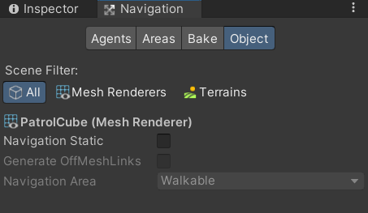
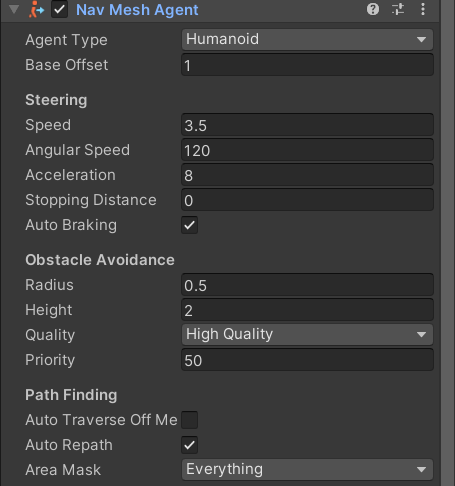

## 1. LayerMask INT 표현법
https://ansohxxn.github.io/unitydocs/layermask/
Layer는 32개로 INT 형의 비트 자리가 Layer 의 값이 됨 - 아래의 연산을 따름

**1 << 원하는 layer 숫자**

## 2. Mathf
여러 수학관련 명령어를 모아둔 클래스

### 2.1 Clamp (float value, float min, float max)
value 의 값을 min과 max 의 범위 내에서 설정하도록 함

## 3. Character Controller
3차원 게임에서 사람 형태의 캐릭터 움직임과 관련된 제어를 위해 사용  
캡슐(Capsule) 형태의 충돌 범위가 포함되어 있음

|속성|의미|
|-|-|
|Slope Limit|올라갈 수 있는 경사 한계 각|
|Step Offset|설정 값보다 낮은 높이의 계단(그 외 오브젝트)을 오를 수 있음|
|Center|Capsule 충돌 범위의 중심점|
|Radius|Capsule 충돌 범위의 반지름 (x, z)|
|Height|Capsule 충돌 범위의 높이 (y)|

### 3.1 C# Script 내 활용
|속성|의미|
|-|-|
|isGround|발 위치의 충돌을 체크,  충돌: true, 비충돌 : false|

## 4. Navigation

### 4.1 Naviation View
경로 : Window -> AI -> Navigation

#### 4.1.1 Navigation - Agents
네비게이션 메시 정보를 바탕으로 움직이는 에이전트에 대한 설정

|속성|의미|
|-|-|
|Name|타입에 보여지는 이름|
|Radius|에이전트의 반지름|
|Height|에이전트의 높이(키)|
|Step Height|오르내릴 수 있는 계단의 높이|
|Max Slope|올라갈 수 있는 경사 각도|

#### 4.1.2 Navigation - Areas
네비게이션 메시로 사용되는 오브젝트들의 구역 설정

|속성|의미|
|-|-|
|Name|구역 이름 **== default values ==** Walkable Not Walkable Jump|
|Cost|구역에 이동하는 데 사용되는 비용, Cost 정보를 기준으로 최단거리 계산을 함|

#### 4.1.3 Navigation - Bake
네비게이션 메시 데이터를 생성

|속성|의미|
|-|-|
|Agent Radius|에이전트가 지나갈 수 있는 반지름|
|Agent Height|에이전트가 아래로 지나갈 수 있는 높이|
|Max Slope|에이전트가 올라갈 수 있는 경사 각도|
|Step Height|에이전트가 오르내릴 수 있는 계단의 높이|
|Drop Height|이동할 수 있는 절벽 아래의 높이|
|Step Height|뛰어너 넘을 수 있는 절벽 거리|

**Bake** 버튼을 누르면 설정된 속성 값을 기준으로 네비게이션 정보를 데이터로 생성
#### 4.1.4 Navigation - Object
현재 Scene 에 있는 오브젝트를 설정

|속성|의미|
|-|-|
|Scene Filter|현재 씬에서 원하는 오브젝트만 선택해서 봄|
|Navigation Static|네비게이션 메시로 사용할지 설정|
|Generate OffMeshLinks|자동으로 Off Mesh를 생성할지 설정|
|Navigation Area|해당 오브젝트의 구역 설정 (구역에 따른 Cost 설정)|

### 4.2 NavMeshAgent
네비게이션 메시 정보를 바탕으로 이동하는 오브젝트

|속성|의미|
|-|-|
|Speed|이동 속도|
|Angluar Speed|방향 전환 시 회전 속도|
|Acceleration|가속도|
|Stopping Distance|목적지가 해당 값까지 가까워지면 정지|
|Auto Braking|목적지에 가까워지면 정지|
|Radius|장애물을 회피할 때의 에이전트 반지름|
|Height|에이전트의 높이|
|Quality|장애물과 충돌 수준 None 이면 뚫고 지나감|
|Priority|장애물과 충돌했을 때 우선순위, 낮을수록 높음|
|Auto Traverse Off Mesh Link|오프 메시 링크가 있을 경우 자동으로 탐색해서 찾아갈지 설정|
|Auto Repath|이동 중 경로 탐색을 다시 할지 설정|
|Area Mask|해당 에이전트의 이동 가능한 구역 지정|

#### 4.2.1 C# Script 내 활용
|메소드|의미|
|-|-|
|SetDestination(Vector3 Position)|position 을 목표지점으로 설정|

### 4.3 OffMeshLink
연결이 끊어져 있는 절벽, 낭떠러지, 사다리 등을 이동 가능하게 설정

|속성|의미|
|-|-|
|Start|시작 위치|
|End|종료 위치|
|Bi Directional|양방향성 이동|

### 4.4 NavMeshObstacle
이동하는 장애물의 네비게이션 메시 정보를 실시간으로 설정

|속성|의미|
|-|-|
|Shape|장애물의 모양|
|Center|Shape의 중심 위치|
|Carve|Navigation Mesh 공간을 비울지 true : 비움  false: 안비움|
|Move Threshold|설정된 거리를 이동하면 오브젝트의 Navigation Mesh 데이터 갱신|
|Time to Stationary|설정된 시간만큼 움직임이 없으면 멈춰있다라고 인식|
|Carve Only Stationary|멈춰 있을 때만 공간을 비울지 true : 멈춰있을 때만 비움 false : 실시간으로 비움|
|Size|Shape 가 Box일 때 Box의 크기|
|Radius|Shape 가 Capsule 일 때 반지름|
|Height|Shape 가 Capsule 일 때 높이|